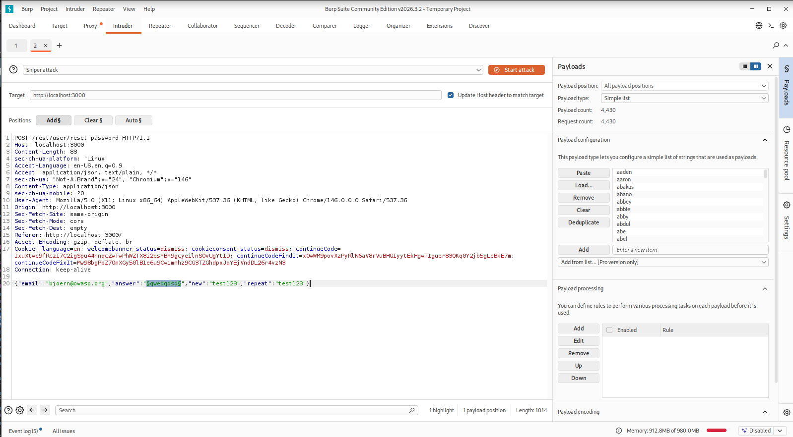
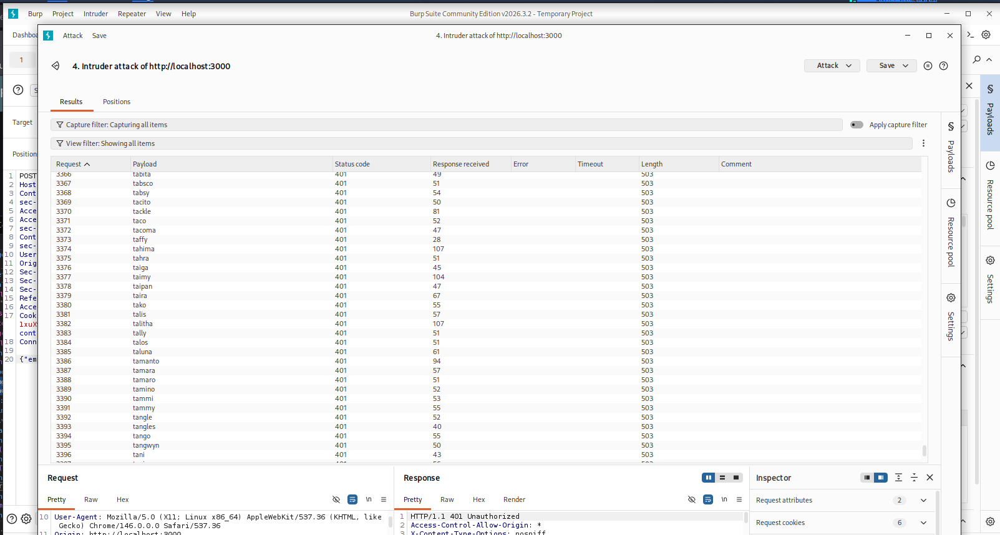

# Pentest-Bericht: Schwachstellen-Dokumentation

## 1. Zusammenfassung (Executive Summary)

A critical vulnerability classified as **Broken Authentication** was identified in the password recovery mechanism. The application allows attackers to send an unlimited number of attempts to answer a user's security question without triggering security mechanisms such as "rate limiting" or "account lockout." As a result, the password for the user `bjoern@owasp.org` could be reset using an automated brute-force attack.

---

## 2. Vulnerability Details

| Parameter | Description |
| :--- | :--- |
| **Vulnerability Type** | Faulty Authentication / Lack of Rate Limiting for Security Queries |
| **OWASP Top 10** | A07:2021-Identification and Authentication Failures |
| **Affected Component** | Password reset feature (`/rest/user/reset-password`) |
| **Tools Used** | Burp Suite Professional / Community Edition (Intruder module) |

---

## 3. Risk Assessment (Risk Analysis)

* **Exploitability:** Easy. Since there are no protective barriers against automated requests, a simple dictionary attack on the answer field is sufficient.
* **Impact:** High. Attackers can completely take over users' accounts, provided the username is known and the answer to the security question can be guessed or determined automatically.

---

## 4. Carrying Out the Attack (PoC)

1. **Identification:** The "Forgot Password" feature was triggered for the target address `bjoern@owasp.org`, which revealed the security question *"Name of your favorite pet?"*.
2. **Intercepting the Request:** The HTTP `POST` request to `/rest/user/reset-password` was intercepted using a local intercepting proxy (Burp Suite).
3. **Automation (Brute Force):** The request was passed to the *Burp Intruder* module. The value in the JSON parameter `"answer"` was defined as the attack target.

4. **Execution 1:** The attack was launched using a wordlist of common pet names. At least 6,300 pet names were collected from two different websites:

* [petplace - top-1200-pet-names](https://www.petplace.com/article/dogs/pet-care/top-1200-pet-names)
* [https://www.edogs.de/magazin/hundenamen-mit-{letter}/](https://www.edogs.de/magazin/hundenamen-mit-a/)
* [https://www.rover.com/blog/cat-names-that-start-with-{letter}/](https://www.rover.com/blog/cat-names-that-start-with-b/)

5. **Result:** For the payload entry **`Zaya`**, the server returned a successful HTTP response (`200 OK`). The password was successfully changed to the value defined in the payload body.

---

## 5. Recommended Remedial Actions

* **Implementation of Rate Limiting:** After a small number of failed attempts (e.g., a maximum of 3 to 5 failed attempts), the IP address or the affected user account must be blocked from further attempts for a defined period of time.
* **Use of CAPTCHAs:** Incorporating a CAPTCHA after the first failed attempt effectively prevents automated bot or intruder attacks.
* **Replacing security questions:** Static security questions are considered insecure according to modern security standards (e.g., NIST guidelines), as the answers can often be determined through social engineering or public profile information (OSINT). It is recommended to use password reset links via email or multi-factor authentication (MFA) instead.
