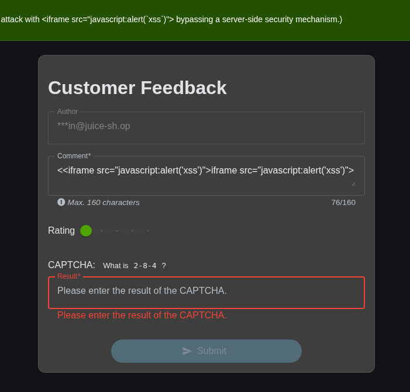

# Server-Side XSS Protection (⭐⭐⭐⭐)

:::note
This project is strictly for educational and research purposes. No real personal data, credentials, or sensitive information were used. Perform security testing only with proper authorization.
:::

:::important 
Run only on approved machines.
:::

## Table of Contents

1. [Executive Summary](#1-executive-summary)
2. [Methodology](#2-methodology)
   * [Attack Flow](#attack-flow)
3. [Findings](#3-findings)
   * [Security Impact](#security-impact)
4. [Remediation](#4-remediation)
5. [Conclusion](#5-conclusion)

---

## 1. Executive Summary

During the security assessment of the **OWASP Juice Shop**, the server-side sanitization of the Customer Feedback functionality was tested for XSS bypasses.

The assessment identified a weakness in the sanitization logic caused by single-pass processing. By using specially crafted nested HTML input, the sanitization process can be bypassed, resulting in a **Stored Cross-Site Scripting (XSS)** vulnerability.

The malicious input is stored and later rendered in the Administration interface, where it can be interpreted as executable HTML in the context of a privileged user.

---

## 2. Methodology

The **Customer Feedback** form was tested with specially crafted HTML input to determine whether the server-side filter could be bypassed.

### Attack Flow

1. Navigate to **Customer Feedback**.
2. Enter the challenge-specific nested `<iframe>` payload into the **Comment** field.
```bash
<<iframe src="javascript:alert('xss')">iframe src="javascript:alert('xss')">
```
3. Submit the feedback.
4. Open the **Administration** dashboard.
5. Observe the stored payload being interpreted by the browser.

The underlying issue is that the sanitizer performs a single processing pass. After the malicious portion is removed, the remaining characters can form a new HTML structure that is not sufficiently revalidated.




---

## 3. Findings

| Item               | Details                                       |
| ------------------ | --------------------------------------------- |
| **Vulnerability**  | Stored Cross-Site Scripting (XSS)             |
| **Affected Field** | `Comment`                                     |
| **Component**      | Customer Feedback / Administration UI         |
| **OWASP**          | A03:2021 – Injection                          |
| **Root Cause**     | Insufficient sanitization and output encoding |

### Security Impact

An attacker may be able to execute JavaScript in the context of a privileged user. Depending on the application's security controls, this could allow:

* Unauthorized actions
* Manipulation of application content
* Access to client-accessible data
* Potential compromise of privileged sessions

---

## 4. Remediation

1. **Update `sanitize-html`** to a current, supported version and review its configuration.
2. **Apply context-aware output encoding** so user input is rendered as data rather than executable HTML.
3. **Validate the final sanitized output** to prevent reconstruction of malicious markup.
4. **Implement a restrictive CSP** as an additional defense-in-depth measure.
5. **Add regression tests** for nested HTML and known XSS sanitization bypasses.

---

## 5. Conclusion

The Customer Feedback functionality is vulnerable to a **Stored XSS attack** due to insufficient server-side sanitization.

The primary remediation is to combine **secure HTML sanitization, proper output encoding, final-output validation, and CSP** to prevent user-controlled content from reaching an executable browser context.
